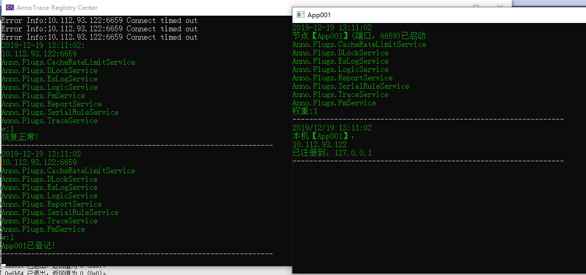
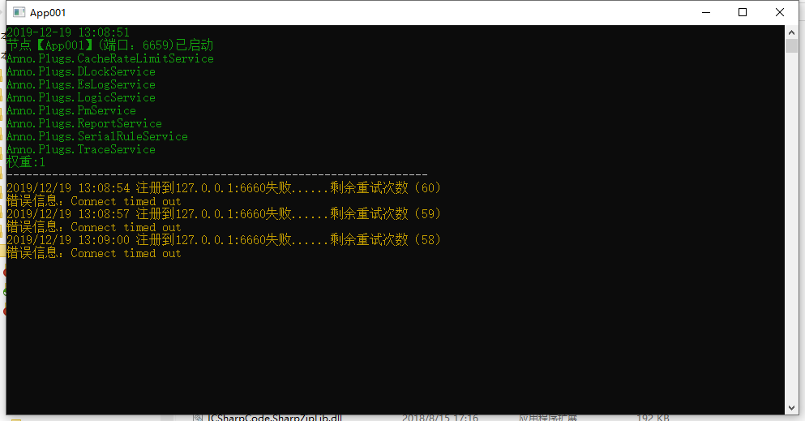
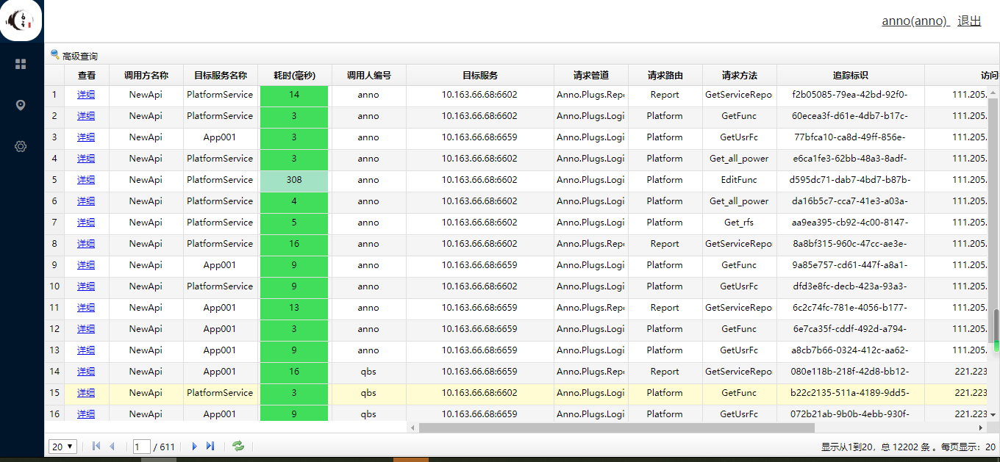
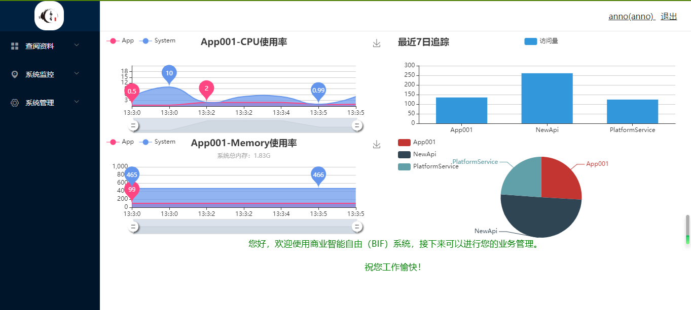

# AnnoDemo
    Anno 分布式开发框架 Demo

##  [Java 实现 ](https://github.com/duyanming/anno.thrift-parent) : https://github.com/duyanming/anno.thrift-parent
    
##  [Demo 在线演示地址](http://140.143.207.244) :http://140.143.207.244
    账号：anno
    密码：123456
# Anno 分布式开发框架

    Anno 是一个分布式开发框架，同时支持 .net core3.1 、.net frameworker4.6.1

## 1、运行Demo
    第一步：启动注册中心
        进入项目文件夹 AnnoDemo\registryCenter\bin\Debug\netcoreapp3.1 ，运行命令 dotnet registryCenter.dll
        看到下图 说明运行成功


    第二步：启动Server  
        Server可以和 AppCenter 不在同一台电脑，也可以运行多个server 也可以负载均衡，高级用法随后介绍
        进入项目文件夹 AAnnoDemo\hostingService\bin\Debug\netcoreapp3.1 ，运行命令 dotnet hostingService.dll
        看到下图 说明 Server 成功运行 并且已经注册到 注册中心（APPCenter）运行成功


启动AnnoWeb

    第三步：调用链追踪
       

    第四步：服务性能监控
       



# Anno EventBus
    Eventbus Support  InMemory and Rabbitmq
## 1、Server配置

```c#
	//指定EventHandler的 所在程序集
	var funcs = Anno.Const.Assemblys.Dic.Values.ToList();
                #region RabbitMQEventBus
                //消费失败通知

                RabbitMQEventBus.Instance.ErrorNotice += (string exchange, string routingKey, Exception exception, string body) =>
                        {
                            Log.Fatal(new { exchange, routingKey, exception, body }, typeof(RabbitMQEventBus));
                        };
                EventBusSetting.Default.RabbitConfiguration = new RabbitConfiguration()
                {
                    HostName = "192.168.100.173",
                    VirtualHost = "dev",
                    UserName = "dev",
                    Password = "dev",
                    Port = 5672
                };
                RabbitMQEventBus.Instance.SubscribeAll(funcs);

                #endregion
                #region InMemory EventBus
                EventBus.Instance.ErrorNotice += (string exchange, string routingKey, Exception exception, string body) =>
                {
                    Log.Fatal(new { exchange, routingKey, exception, body }, typeof(EventBus));
                };
                EventBus.Instance.SubscribeAll(funcs);

 ```  

## 2、EventData配置

```c#

	using Anno.EventBus;
	
	namespace Events
	{
	    public class FirstMessageEvent:EventData
	    {
	        public string Message { get; set; }
	    }
	}

 ```  

 
## 3、EventHandler配置

```c#
	
	namespace Anno.Plugs.SamsundotService.EventHandler
	{
	    using Anno.EventBus;
	    using Events;
	
	    class FirstMessageEventHandler : IEventHandler<FirstMessageEvent>
	    {
	        public void Handler(FirstMessageEvent entity)
	        {
	            Log.Log.Info(new { Plugs= "Samsundot",Entity=entity },typeof(FirstMessageEventHandler));
	        }
	    }
	}

 ```  

 ```c#
	
	namespace Anno.Plugs.YYTestService.EventHandler
	{
	    using Anno.EventBus;
	    using Events;
	
	    class FirstMessageEventHandler : IEventHandler<FirstMessageEvent>
	    {
	        public void Handler(FirstMessageEvent entity)
	        {
	            Log.Log.Info(new { Plugs = "YYTest", Entity = entity }, typeof(FirstMessageEventHandler));
	        }
	    }
	    /// <summary>
	    /// 异常消费演示，测试 消费失败通知
	    /// </summary>
	    class FirstMessageExceptionEventHandler : IEventHandler<FirstMessageEvent>
	    {
	        public void Handler(FirstMessageEvent entity)
	        {
	            Log.Log.Info(new { Plugs = "YYTest",Handle= "FirstMessageExceptionEventHandler", Entity = entity }, typeof(FirstMessageEventHandler));
	            throw new Exception("异常消费演示，测试 消费失败通知 From FirstMessageExceptionEventHandler!");
	        }
	    }
	}

 ```  

## 4、中间件
### 4.1 缓存中间件
#### nuget install

```shell

Install-Package Anno.EngineData.Cache

```

 ```c#
	
using System;
using System.Collections.Generic;
using System.Text;
using Anno.EngineData;
using Anno.EngineData.Cache;


namespace Anno.Plugs.CacheRateLimitService
{
    public class CacheModule : BaseModule
    {
        /*
        参数1：缓存长度
        参数2：缓存存活时间
        参数3：缓存存活时间是否滑动
        */
        [CacheLRU(5,6,true)]
        public ActionResult Cache(string msg)
        {
            Console.WriteLine(msg);
            return new ActionResult(true, null,null,msg);
        }
    }
}

 ``` 

 ### 4.2 限流中间件
#### nuget install

```shell

Install-Package Anno.EngineData.RateLimit

```

 ```c#
	
using System;
using System.Collections.Generic;
using System.Text;
using Anno.EngineData;
using Anno.RateLimit;

namespace Anno.Plugs.CacheRateLimitService
{
    public class LimitModule : BaseModule
    {
        /*
        参数1：限流算法是令牌桶还是漏桶
        参数2：限流时间片段单位秒
        参数3：单位时间可以通过的请求个数
        参数4：桶容量
        */
        [EngineData.Limit.RateLimit(LimitingType.TokenBucket,1,5,5)]
        public ActionResult Limit(string msg)
        {
            Console.WriteLine(msg);
            return new ActionResult(true, null, null, msg);
        }
    }
}

 ``` 


#dotnet
dotnet publish "E:\gitProject\Anno\DCS\AppCenter\AppCenter.csproj" -c Release -r linux-x64 -o "E:\gitProject\Anno\DCS\AppCenter\bin"

#配置文件说明
```json
{
  "Target": {
    "AppName": "traceWeb",--服务名称
    "IpAddress": "127.0.0.1",--注册中心地址
    "Port": 6660,--注册中心端口
    "TraceOnOff": true--启用调用链追踪
  },
  "Limit": {--限流
    "Enable": true,--是否启用限流
    "TagLimits": [--标签限流
      {
        "channel": "*",--管道
        "router": "*",--路由
        "timeSpan": "10",--时间片单位秒
        "rps": 1,--时间片内的 有效请求个数
        "limitSize": 2--漏桶容量大小 做缓冲用
      }
    ],
    "IpLimit": {--IP限流
      "timeSpan": 1,
      "rps": 20,
      "limitSize": 200
    },
    "WhiteList": [--白名单
      "192.168.1.1",
      "192.168.2.18"
    ]
  }
}

```
